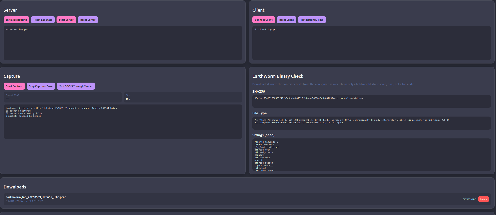
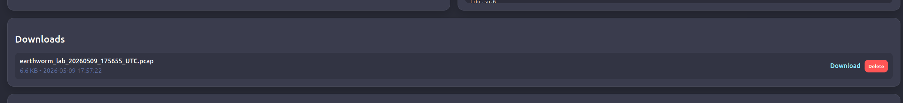
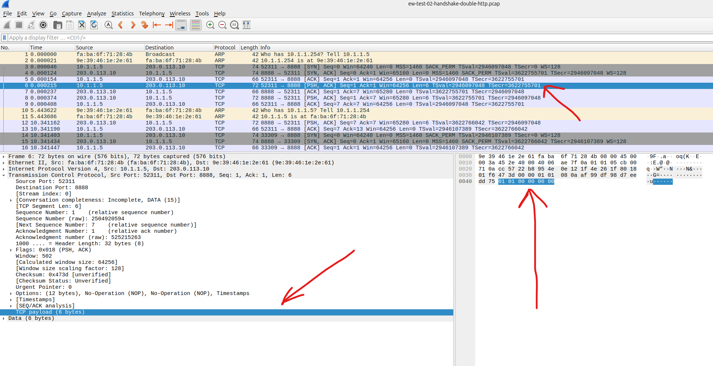
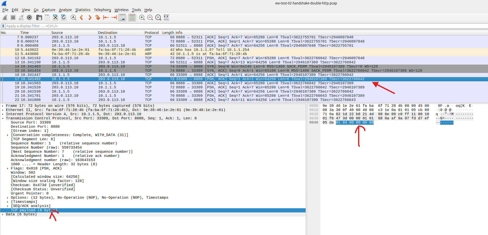

# EarthWorm Reverse SOCKS PCAP Lab

Local-only Docker lab for generating EarthWorm reverse SOCKS PCAPs with a browser UI.


## What it does

- Binds the UI only to `127.0.0.1:23456`
- Downloads the EarthWorm Linux binary from the configured mirror during image build
- Records lightweight binary artifacts inside the UI for sanity review:
  - `file` output
  - `sha256`
  - first 200 `strings`
- Starts/stops the reverse SOCKS server and client
- Tests the SOCKS tunnel against a local target web server
- Starts/stops packet capture on the router path
- Captures on the router's internal-side interface to avoid duplicate packets from `-i any`
- Lets you download or delete saved `.pcap` files from the UI

## Safety notes

- This is intended for local detection-engineering use only.
- The UI binds to localhost only.
- No host networking is used.
- EarthWorm ports are not published to the host.
- The public-looking server IP is documentation-only `203.0.113.10`.
- The old 32-bit EarthWorm binary needed container isolation and `seccomp=unconfined` on the server/client containers to function correctly inside Docker.
- Saved PCAPs under `pcaps/` are ignored by git so test artifacts stay out of future repo pushes.

## Start the lab

```bash
docker compose up -d
```

Open:

- <http://127.0.0.1:23456>

## Main workflow

1. Initialize Routing
2. Start Server
3. Connect Client
4. Test SOCKS Through Tunnel
5. Start Capture
6. Generate tunnel activity
7. Stop Capture / Save
8. Download the PCAP





## Current verified facts

- Mirror URL currently downloads a 32-bit ELF EarthWorm binary.
- Observed SHA256:

```text
95d2ea175a231758503f47fa5c3bcbe647327b9deaae76808b6dda647b574ecd
```

- Verified working flow on May 9, 2026:
  - server listeners on `:8888` and `:1080`
  - client reverse connection established
  - SOCKS HTTP fetch to `10.1.1.50` succeeded through the tunnel
  - PCAP capture saved and downloadable from the UI

## Useful packet patterns

Fresh setup captures consistently showed small control records like:

- `01 01 00 00 00 00`
- `01 02 00 00 00 00`
- often `01 03 00 00 00 00`

Request-stage captures consistently showed:

- `01 04 00 00 00 00`
- `01 05 00 00 00 00`
- followed by SOCKS negotiation bytes such as `05 02 00 01`, `05 00`, and `05 01 00 01 ...`





## Optional sample PCAPs

If you do not want to run the lab, curated example PCAPs are included under:

- `./sample-pcaps/`

See:

- `./sample-pcaps/README.md`

Included samples currently cover:

- handshake plus single HTTP request
- handshake plus multiple HTTP requests
- request-stage activity after setup is already up
- reconnect-oriented handshake traffic
- one older duplicate-artifact capture retained for comparison

## Output directory

- Saved lab captures: `./pcaps/`
